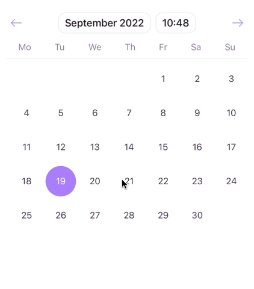
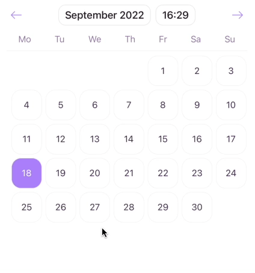
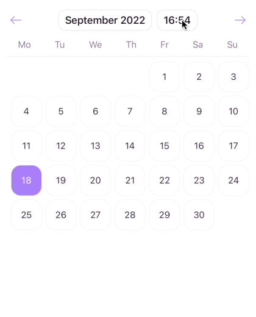
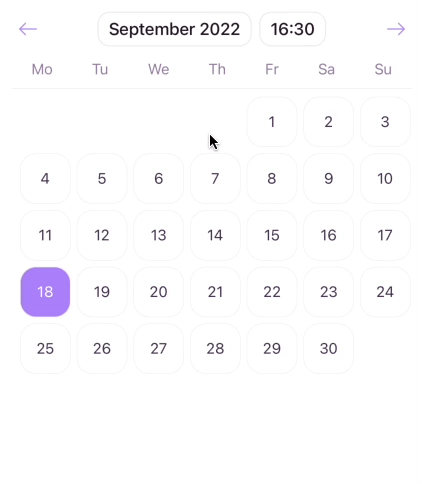

[](https://github.com/WrathChaos/react-native-time-date-picker)

[](https://www.npmjs.com/package/react-native-time-date-picker)
[](https://www.npmjs.com/package/react-native-time-date-picker)

[](https://opensource.org/licenses/MIT)
[](https://github.com/prettier/prettier)

<p align="center">
  
</p>
<p align="center">
  
</p>
<p align="center">
  
</p>
<p align="center">
  
</p>

# Documentation

- [Getting Started](https://github.com/WrathChaos/react-native-time-date-picker#installation)
- [Usage](https://github.com/WrathChaos/react-native-time-date-picker#usage)
- [Configuration](https://github.com/WrathChaos/react-native-time-date-picker#configuration---props)
- [Localization](./docs/translations.md)
- [Localization Contribution](./docs/contributions/translations.md)

# Installation

Add the dependency:

```bash
npm i react-native-time-date-picker
```

## Peer Dependencies

<h5><i>IMPORTANT! You need install them</i></h5>

```json
"moment": ">= 2.29.4",
"@freakycoder/react-native-bounceable": ">= 1.0.3"
```

# Usage

## Import

```jsx
import { TimeDatePicker, Modes } from "react-native-time-date-picker";
```

## Fundamental Usage

```jsx
const now = moment().valueOf();

<TimeDatePicker
  selectedDate={now}
  mode={Modes.date}
  onMonthYearChange={(month: number) => {
    console.log("month: ", month); // 1643366100000
    console.log("month formatted: ", moment(month).format("MM")); // 04
    console.log("month formatted: ", moment(month).format("MMM")); // Apr
    console.log("month formatted: ", moment(month).format("MMMM")); // April
  }}
  onSelectedChange={(selected: number) => {
    console.log("selected Date: ", selected); // 1649846100000
    console.log(
      "selected date formatted: ",
      moment(selected).format("YYYY/MM/DD HH:mm"),
    ); // 2022/04/13 13:35
  }}
  onTimeChange={(time: number) => {
    console.log("time: ", time); // 1643331840000
    console.log("time formatted: ", moment(time).format("HH:mm")); // 04:04
  }}
/>;
```

## Customization Example Usage

```jsx
const now = moment().valueOf();

<TimeDatePicker
  selectedDate={now}
  mode={Modes.time}
  options={{
    daysStyle: {
      borderRadius: 16,
      borderWidth: 0.5,
      borderColor: "#f1f1f1",
    },
    is24Hour: false,
  }}
  onMonthYearChange={(month) => {
    console.log("month: ", month);
  }}
  onSelectedChange={(selected) => {
    console.log("selected: ", selected);
  }}
  onTimeChange={(time) => {
    console.log("time: ", time);
  }}
/>;
```

## Example Project 😍

You can checkout the example project 🥰

Simply run

- `npm i`
- `react-native run-ios/android`

should work of the example project.

# Configuration - Props

## Fundamentals

| Property          |   Type   |  Default   | Description                                                                                          |
| ----------------- | :------: | :--------: | ---------------------------------------------------------------------------------------------------- |
| mode              |  Modes   | Modes.date | change the picker's main component (options: Modes.date, Modes.time, Modes.monthYear, Modes.calendar |
| currentDate       |   Date   | new Date() | set the current date which initially visible month                                                   |
| selectedDate      |  string  | undefined  | set the selected date which primarly value of date picker                                            |
| onSelectedChange  | function |  default   | set your own logic when the date is selected                                                         |
| onTimeChange      | function |  default   | set your own logic when the time is changed                                                          |
| onMonthYearChange | function |  default   | set your own logic when the month year is selected                                                   |

## Customization (Optionals)

| Property               |   Type    | Default | Description                                                      |
| ---------------------- | :-------: | :-----: | ---------------------------------------------------------------- |
| style                  | ViewStyle | default | set or override the style object for the main container          |
| minimumDate            |  string   | default | set the minimum selectable day from user                         |
| maximumDate            |  string   | default | set the maximum selectable day from user                         |
| selectorStartingYear   |  number   |    0    | change the minimum selectable year for year picker               |
| selectorEndingYear     |  number   |    0    | change the maximum selectable year for year picker               |
| disableDateChange      |  boolean  |  false  | disable the month & year from being changed                      |
| onToggleTime           | function  | default | set your own logic when the header time is toggled               |
| onToggleMonth          | function  | default | set your own logic when the header month is toggled              |
| onTimeCancelPress      | function  | default | set your own logic when the time select cancel button is pressed |
| disableTimeCloseButton |  boolean  |  false  | disable the time close button if you do not need it              |

## Customization for Options Prop

```js
const defaultOptions: IOptions = {
  backgroundColor: "#fff",
  textHeaderColor: "#241523",
  textDefaultColor: "#432d50",
  selectedTextColor: "#fff",
  mainColor: "#aa7ff9",
  textSecondaryColor: "#967aa5",
  borderColor: "rgba(53, 33, 52, 0.1)",
  defaultFont: "System",
  headerFont: "System",
  textFontSize: 15,
  textHeaderFontSize: 17,
  headerAnimationDistance: 100,
  daysAnimationDistance: 200,
  daysStyle: {},
  is24Hour: true,
};
```

## Credits

Heavily inspired by [react-native-modern-datepicker](https://github.com/HosseinShabani/react-native-modern-datepicker)

Re-written whole structure with Typescript and enhanced with lots of ways with better coding, types and localization

## Future Plans

- [x] ~~LICENSE~~
- [x] ~~Better integration with date timestamp (number) based~~
- [ ] Better Documentation
- [ ] Website
- [ ] Write an article about the lib on Medium

## Author

FreakyCoder, kurayogun@gmail.com

## License

React Native Time Date Picker is available under the MIT license. See the LICENSE file for more info.
